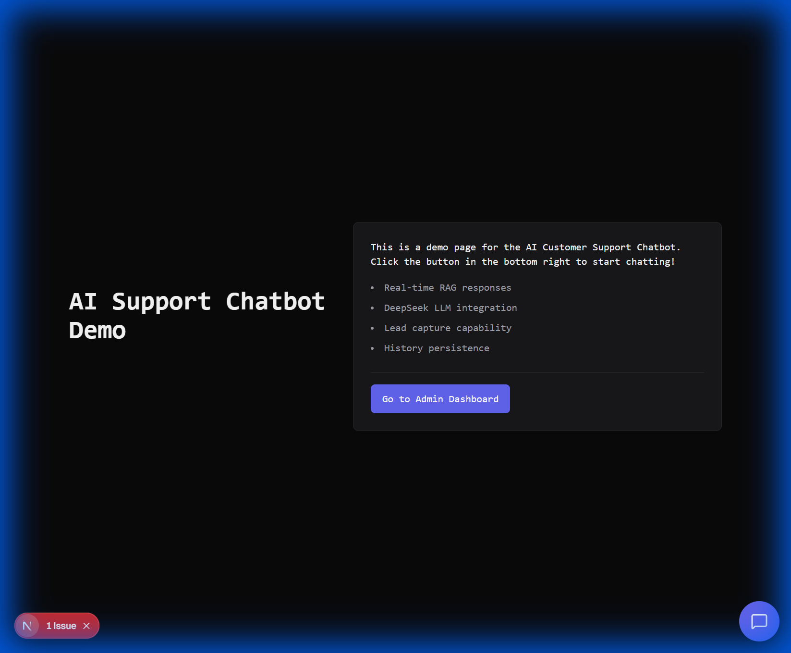
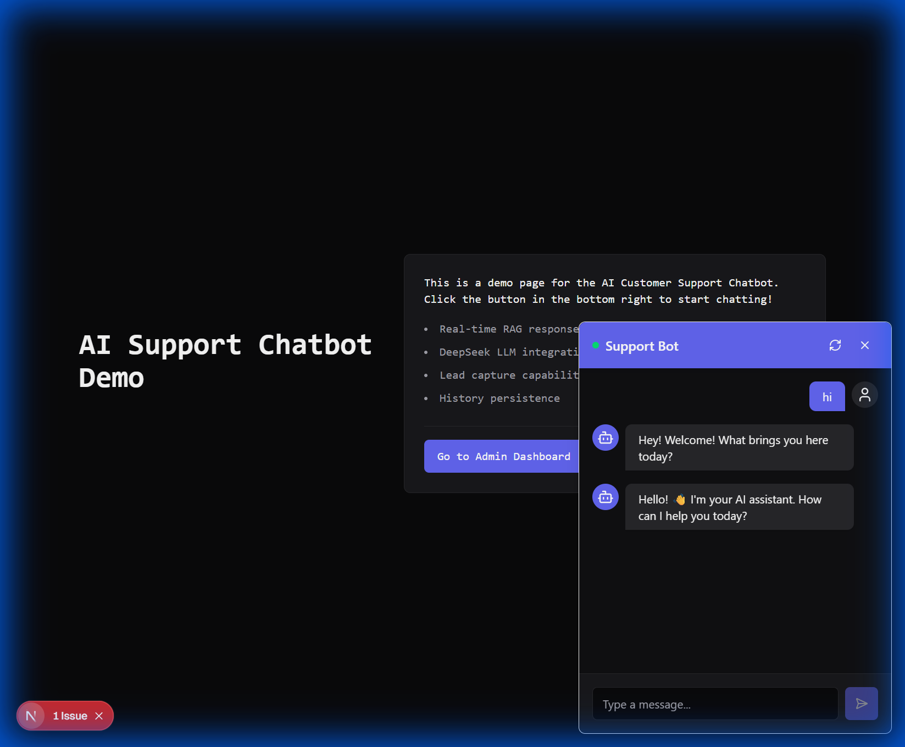
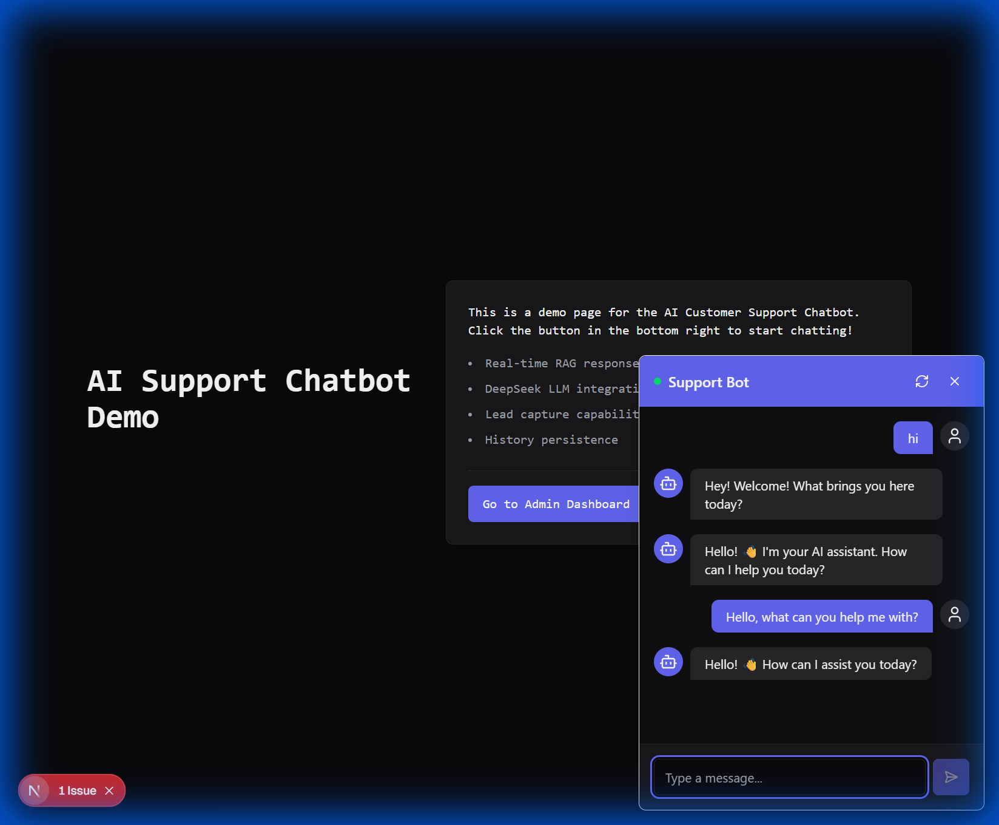
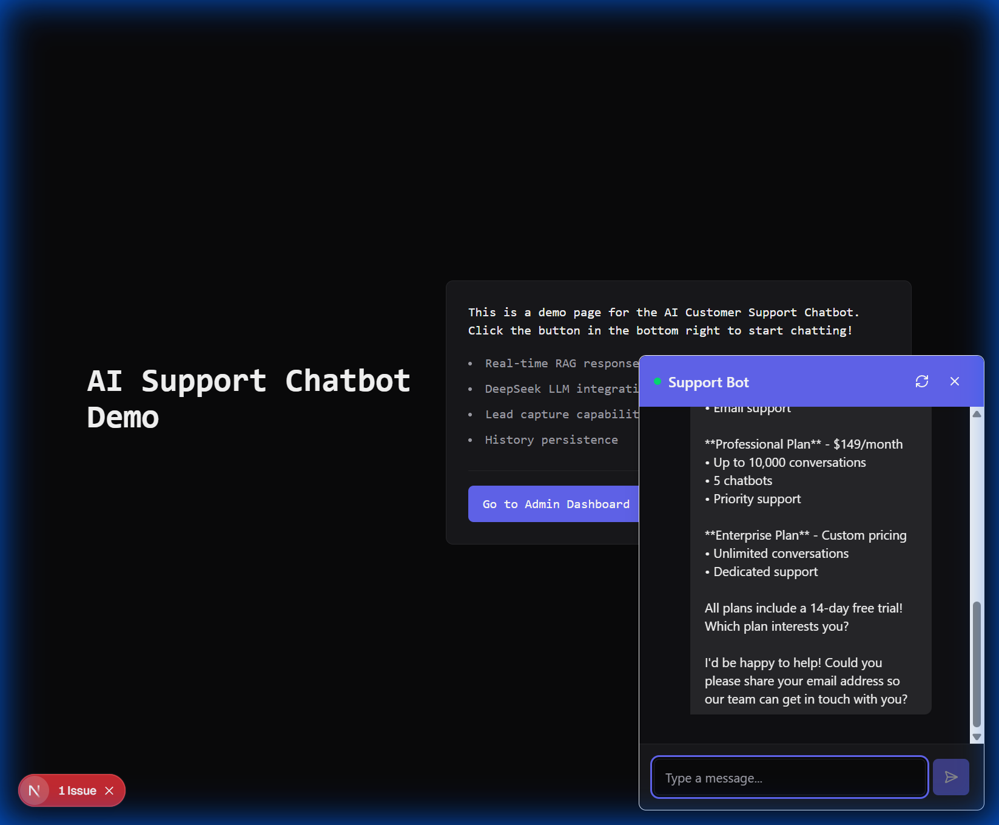
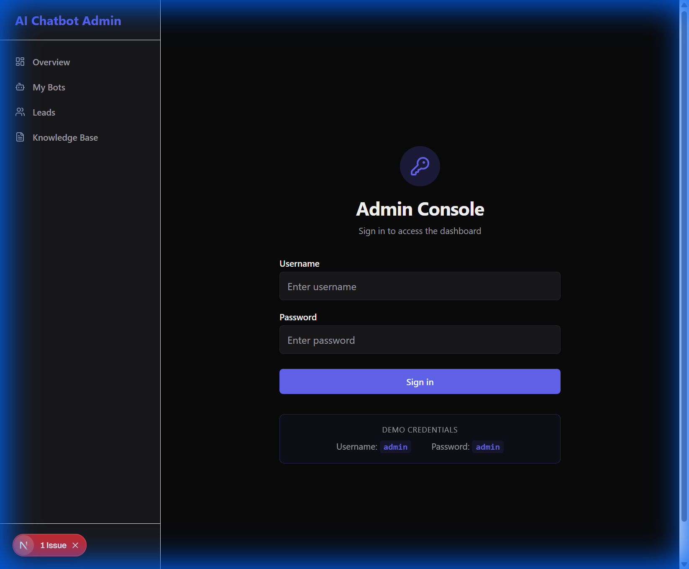

# AI Customer Support Chatbot - Visual Walkthrough 📸

This document provides a visual tour of the AI Customer Support Chatbot system. Screenshots are included to help you understand each feature without running the application.

---

## 1. Landing Page

The main page where visitors land. Features a clean dark theme with information about the chatbot capabilities.



**Key Features:**
- Modern dark UI design
- Feature highlights
- Link to Admin Dashboard
- Chat widget button (bottom-right corner)

---

## 2. Chat Widget

Click the blue chat icon to open the AI-powered chat widget.



**Features:**
- Real-time messaging
- Typing indicators
- Smooth animations
- Session persistence

---

## 3. AI Conversations

The chatbot intelligently responds to user queries using pattern matching and RAG.



**Try asking:**
- "What are your pricing plans?"
- "How do I get started?"
- "Tell me about your features"

---

## 4. Pricing Inquiries

The bot provides detailed pricing information from its knowledge base.



**Lead Capture:** When users express interest (e.g., "contact me" or share their email), the system automatically captures their information as a lead.

---

## 5. Admin Login

Access the admin dashboard with secure authentication.



**Demo Credentials:**
- **Username:** `admin`
- **Password:** `admin`

---

## 6. Admin Dashboard

The central hub for monitoring your chatbot's performance.


**Dashboard Stats:**
- **Total Sessions** - Number of chat conversations
- **Leads Captured** - Users who provided contact info
- **Active Bots** - Configured chatbot instances
- **Documents** - Knowledge base files

**Sections:**
- Real-time statistics
- Recent activity feed
- System health status

---

## Quick Start Commands

### Start the Backend
```bash
cd backend
venv\Scripts\activate
python -m app.main
```
*Runs on http://localhost:8001*

### Start the Frontend
```bash
cd frontend
npm run dev
```
*Runs on http://localhost:3000*

### Seed Demo Data
```bash
cd backend
python seed_data.py
```

---

## Project Structure

```
demo/
├── backend/           # FastAPI server
│   ├── app/          # Application code
│   ├── seed_data.py  # Demo data seeder
│   └── requirements.txt
├── frontend/          # Next.js application
│   ├── app/          # Pages
│   ├── components/   # React components
│   └── lib/          # Utilities & API
├── core/             # Documentation
│   ├── USAGE.md      # User manual
│   ├── PROJECT_OVERVIEW.md
│   ├── WALKTHROUGH.md  # This file
│   └── screenshots/  # Demo images
└── README.md         # Quick start guide
```

---

## Need Help?

- Check `USAGE.md` for detailed instructions
- Review `PROJECT_OVERVIEW.md` for architecture details
- Backend API docs available at `http://localhost:8001/docs`
